# Drool
Buy animal food 

### Homepage
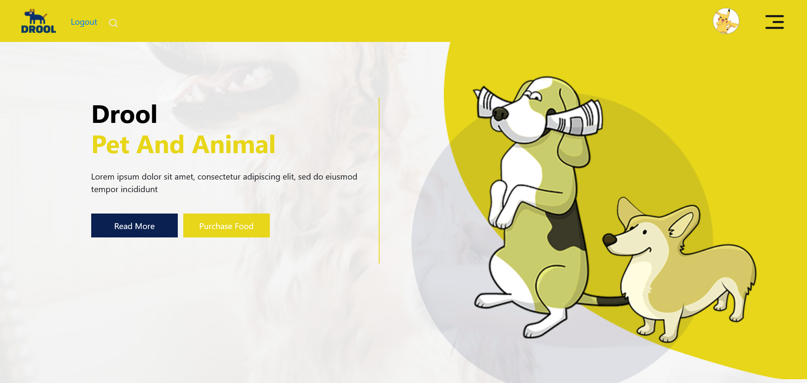

### Products Page
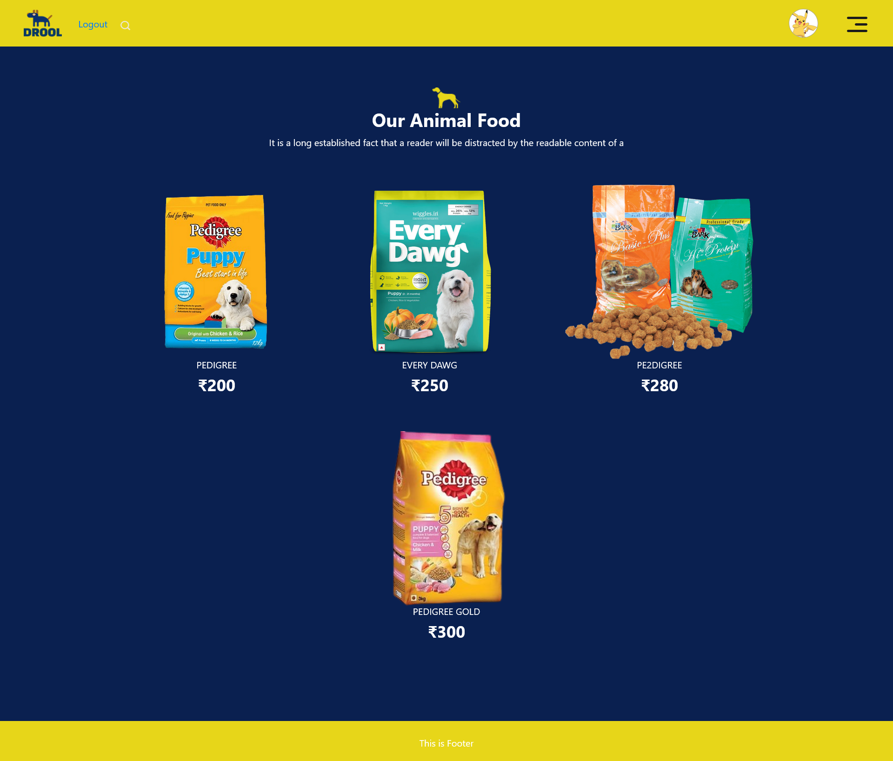 
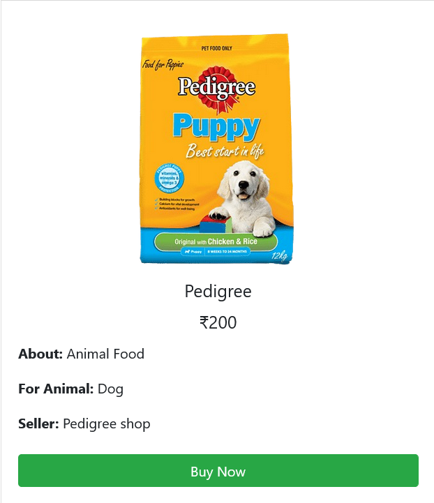

(Working on the payment integration with laravel)

### Register
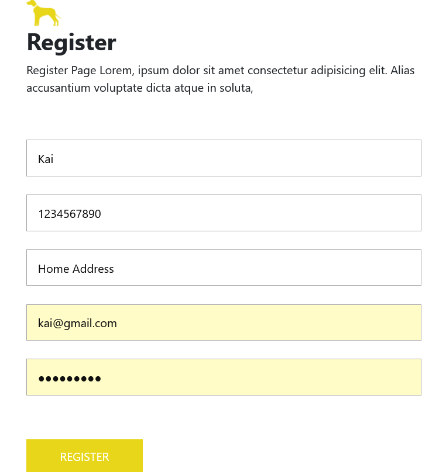 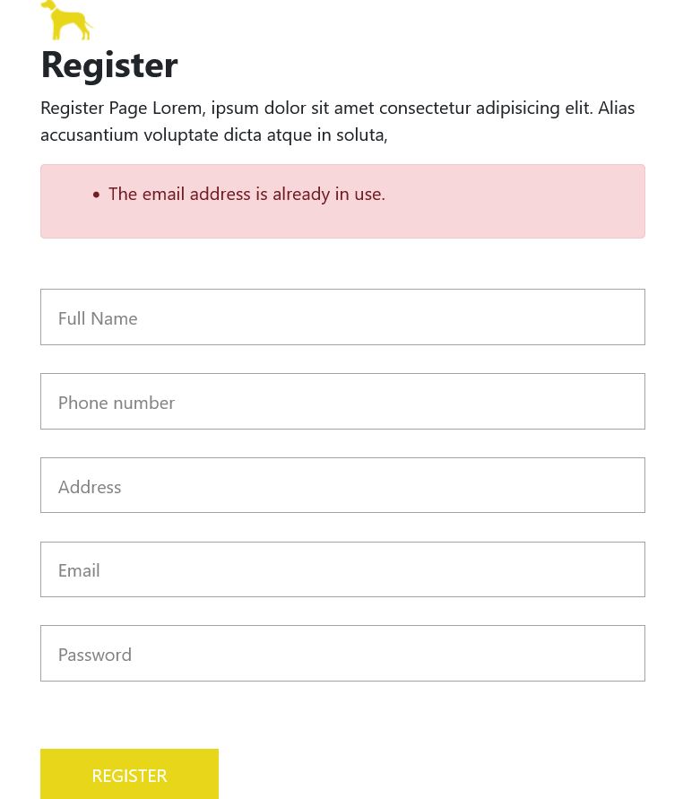
### Login
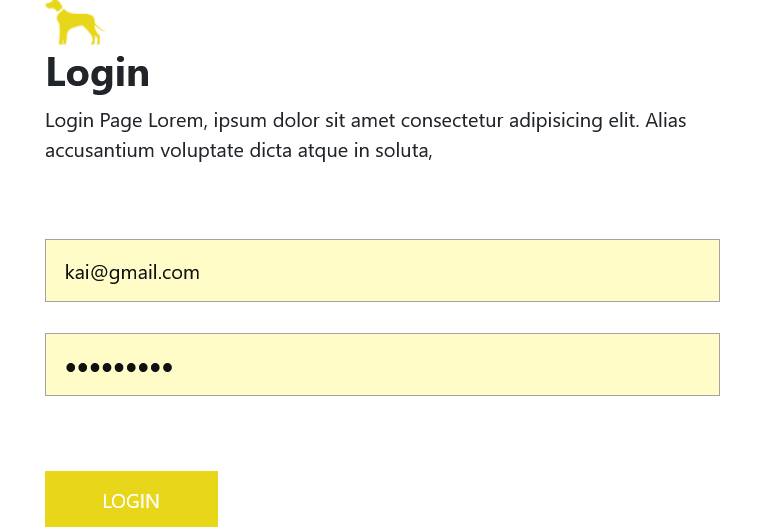

### Profile Page
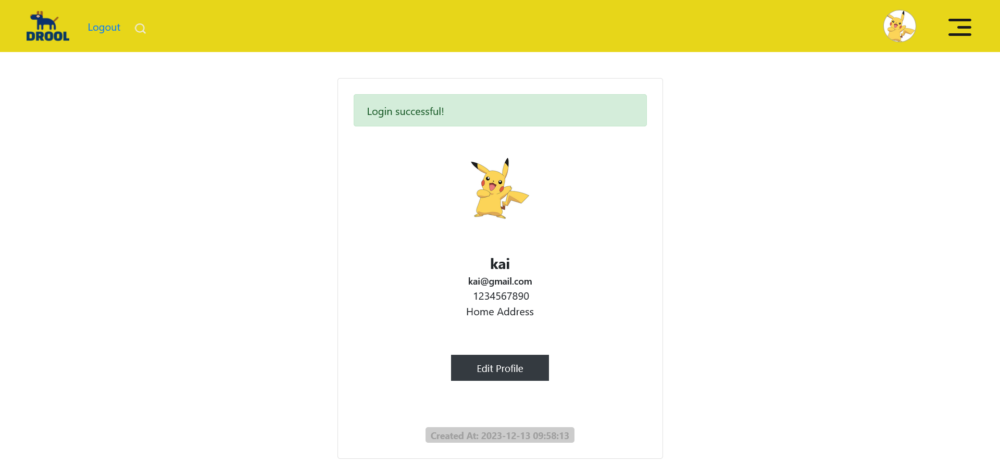
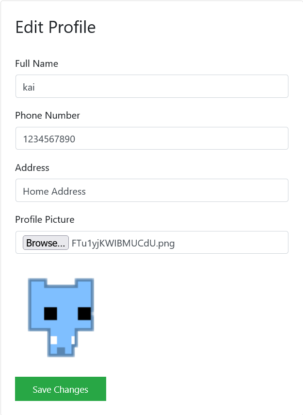

### Admin Section
Giving Admin access to admin panel through Navbar
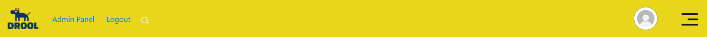

Admin Panel
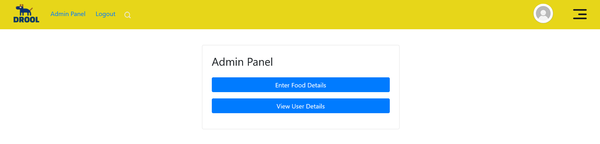
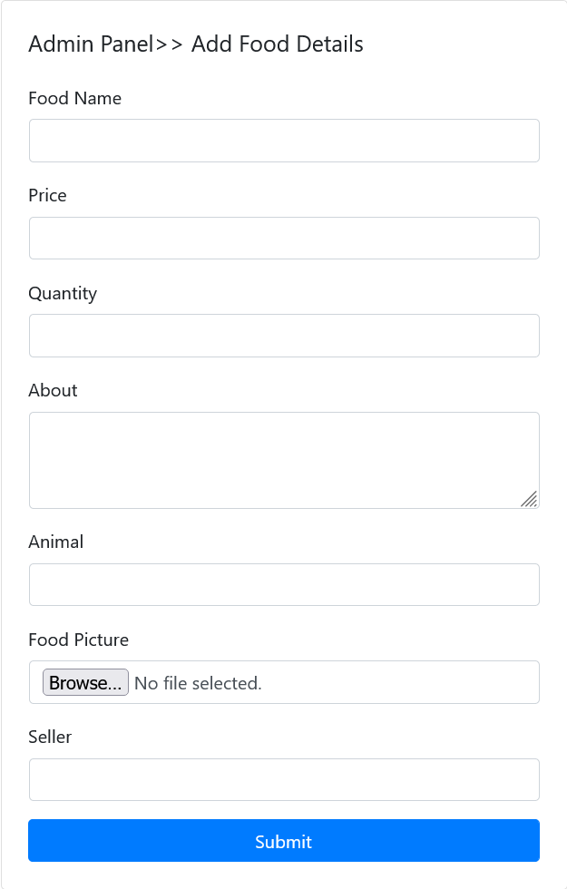
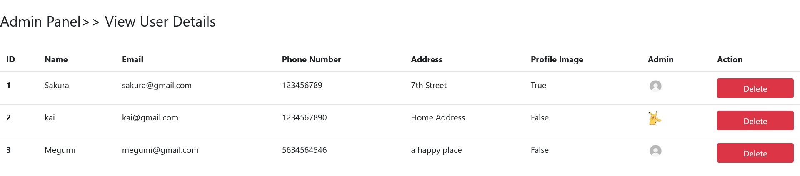

## License

The Laravel framework is open-sourced software licensed under the [MIT license](https://opensource.org/licenses/MIT).
